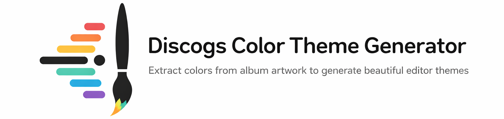

<p align="center"></p>

Generate color themes from Discogs album art. Pick a random vinyl release, extract colors from its cover, and apply the palette to your editor.

Works in **VS Code**, **Cursor**, and any editor that supports VS Code extensions.

---

## Quick Start

1. Install the extension (from VSIX or marketplace)
2. `Ctrl+Shift+P` (or `Cmd+Shift+P` on Mac) → **Open Discogs Theme Generator**
3. Click **Randomly Refresh Discogs Theme** — a random release is fetched and its colors become your theme

---

## Features

- **Randomly Refresh Discogs Theme** — fetches random vinyl releases and builds themes from album art
- **Generate Random** — random color palettes without Discogs
- **History** — browse and reload past themes
- **Auto-refresh** — optional interval or on workspace open
- **Scope** — apply to this window only or all windows

---

## Build VSIX

To create an installable `.vsix` file:

**1. Install the packaging tool** (once):

```bash
npm install -g @vscode/vsce
```

**2. Build a new version and package:**

Bump the version in `package.json`, then run:

```bash
npm run bundle
vsce package
```

Or use `npm version` to bump and tag in one step:

```bash
npm version patch   # 0.0.5 → 0.0.6
npm run bundle
vsce package
```

Use `patch` (bug fixes), `minor` (new features), or `major` (breaking changes). This produces a file like `discogs-theme-generator-0.0.6.vsix` in the project root.

---

## Publish to VS Code Marketplace

To build and publish the extension to the [VS Code Marketplace](https://marketplace.visualstudio.com/):

**1. Get a Personal Access Token (PAT):**

- Go to [Azure DevOps](https://dev.azure.com) → your organization → **User settings** (top right) → **Personal access tokens**
- Create a new token with **Marketplace (Publish)** scope (or **Full access**)
- Copy the token (it is shown only once)

**2. Bump version, build, and publish:**

```bash
npm version patch
npm run bundle
vsce publish --pat YOUR_AZURE_PERSONAL_ACCESS_TOKEN
```

Or set the token in the environment (recommended so it’s not in shell history):

```bash
# Windows (PowerShell)
$env:VSCE_PAT = "YOUR_AZURE_PERSONAL_ACCESS_TOKEN"
vsce publish

# Windows (cmd)
set VSCE_PAT=YOUR_AZURE_PERSONAL_ACCESS_TOKEN
vsce publish
```

`vsce publish` runs the prepublish script (which runs `bundle`), then packages and uploads the extension. The first time you publish, you may need to log in or confirm the publisher.

---

## Install from VSIX

```bash
# VS Code
code --install-extension discogs-theme-generator-0.0.1.vsix

# Cursor
cursor --install-extension discogs-theme-generator-0.0.1.vsix
```

Or: **Extensions** → **⋯** → **Install from VSIX…**

---

## Development

```bash
npm install
npm run watch
```

Press **F5** in VS Code or Cursor to launch the Extension Development Host.

---

## Requirements

- Node.js 18+
- VS Code 1.85+ or Cursor (any recent version)
